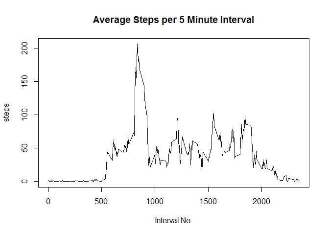
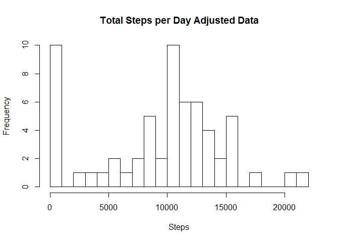
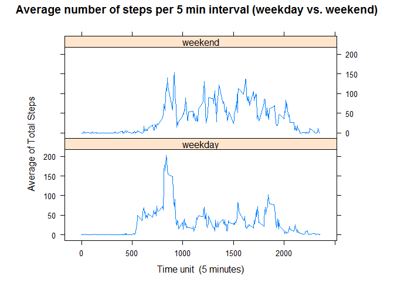

# Reproducible Research: Peer Assessment 1
emil traicu  
October 25, 2016  


## Loading and preprocessing the data
Data has been loaded from "activity.csv" file. 

```r
if (!exists("rawdata")){
    rawdata <- read.csv("activity.csv")
}
```

## What is mean total number of steps taken per day?

### Total number of steps taken each day 


```r
data <- aggregate(steps ~ date, data=rawdata, sum, na.rm = TRUE)
hist(data$steps, breaks=20, main="Total Steps per Day", xlab="Steps", ylab="Frequency")
```

<!-- -->

### Mean & median steps per day

```r
rawsteps_mean <- mean(data$steps, na.rm=TRUE)
rawsteps_median <- median(data$steps, na.rm=TRUE)
print(paste("The mean steps per day is: ", round(rawsteps_mean, digits=2)))
```

```
## [1] "The mean steps per day is:  10766.19"
```

```r
print(paste("The median steps per day is: ", round(rawsteps_median, digits=2)))
```

```
## [1] "The median steps per day is:  10765"
```

## What is the average daily activity pattern?

### Average daily activity pattern


```r
stepsdata <- aggregate(steps ~ interval, data=rawdata, mean, na.rm=TRUE)
plot(stepsdata$interval, stepsdata$steps, type="l", main="Average Steps per 5 Minute Interval",
     xlab="Interval No.", ylab="steps")
```

<!-- -->

### Maximum number of steps in a five minute interval


```r
maxsteps <- max(stepsdata$steps)
print(paste("The maximum number of steps in a 5 minute interval is: ", round(maxsteps, digits=2)))
```

```
## [1] "The maximum number of steps in a 5 minute interval is:  206.17"
```

## Imputing missing values

### Total number of missing values in the dataset 


```r
missingdata <- sum(is.na(rawdata$steps))
print(paste("There are", missingdata, "missing data points."))
```

```
## [1] "There are 2304 missing data points."
```

### Strategy for filling in all of the missing values in the dataset.
I replaced NA valueS with the median value in the data set.


```r
betterdata <- rawdata
betterdata$steps[is.na(betterdata$steps)] <- median(rawdata$steps, na.rm=TRUE)
```

### Adjusted histogram of the total number of steps taken each day

```r
betterdataday <- aggregate(steps ~ date, data=betterdata, sum, na.rm=TRUE)
hist(betterdataday$steps, breaks=20, main="Total Steps per Day Adjusted Data",
     xlab="Steps", ylab="Frequency")
```

<!-- -->

### Adjusted mean & median steps per day

```r
bettersteps_mean <- mean(betterdataday$steps)
bettersteps_median <- median(betterdataday$steps)
print(paste("The adjusted mean steps per day is: ", round(bettersteps_mean, digits=2)))
```

```
## [1] "The adjusted mean steps per day is:  9354.23"
```

```r
print(paste("The adjusted median steps per day is: ", round(bettersteps_median, digits=2)))
```

```
## [1] "The adjusted median steps per day is:  10395"
```

## Are there differences in activity patterns between weekdays and weekends?
### Panel plot comparing the average number of steps taken per 5-minute interval across weekdays and weekends


```r
betterdata$date <- as.Date(betterdata$date)
betterdata$dayname <- weekdays(betterdata$date)
betterdata$weekend <- as.factor(ifelse(betterdata$dayname == "Saturday" |
                                 betterdata$dayname == "Sunday", "weekend", "weekday"))
library(lattice)
plotdata <- aggregate(steps ~ interval + weekend, betterdata, mean)
xyplot(steps ~ interval | factor(weekend), data=plotdata, aspect=1/3, type="l", xlab="Time unit  (5 minutes)",main="Average number of steps per 5 min interval (weekday vs. weekend)", ylab="Average of Total Steps")
```

<!-- -->

There is more activity on weekend as comparing with weekdays
